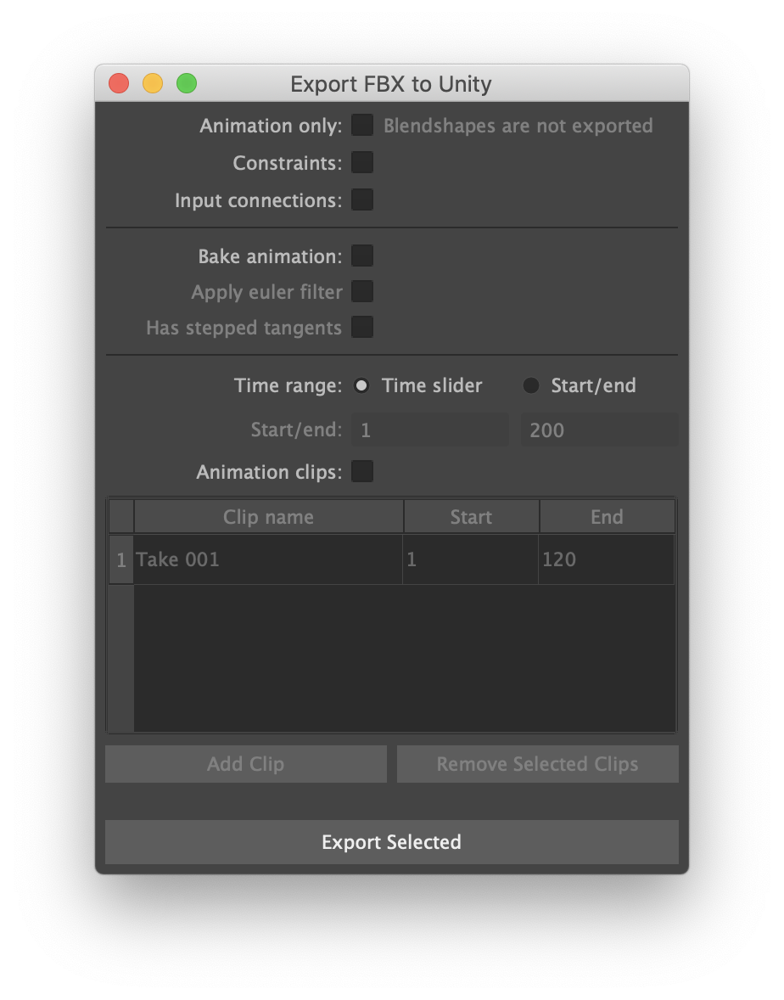

# Export FBX to Unity

A pipeline tool for simplifying FBX export from Maya for use in Unity and potentially other game engines. The tool uses Maya's own FBX plugin but includes some features for baking animation.

<p align="center">

</p>

## Features

- File name is saved with the Maya file (use forward slashes for subfolders). 
- Export folder is globally set (like a specific folder in your Unity project).
- Custom animation bake method that works well with "stepped" animation.
- Easy setup of animation clips.

## Installation

Copy __[exportfbxtounity.py](https://github.com/mortenblaa/maya/raw/master/scripts/fileIO/export_fbx_to_unity/exportfbxtounity.py)__ to Maya's scripts folder.

Add this Python code to a shelf button or execute it from the Script Editor

```python
import exportfbxtounity
exportfbxtounity.create()
```

## Description

#### File name
Output filename. It is recommended to use Unity's naming convention like _MyModel@SomeAnimation_.

#### Export folder
The root folder for exporting. For example, setting the export folder to _/UnityProject/Assets/Animation/_ and a file name of _MyCharacter/MyCharacter@Idle_ will create a file at _/UnityProject/Assets/Animation/MyCharacter/MyCharacter@Idle_.

#### Time range
Current visible time slider range or a range defined by start/end.

#### Input connections
Should the selected nodes include input connections when exporting? Can in most cases be disabled. See the FBX documentation on input connections for more information.

#### Animation only
Only export animation without geometry/shape nodes. Note that for blendshapes to work, this __must__ be turned off!

#### Bake animation
Bake the animation using Maya's animation baking, with some processing applied afterwards.

#### Apply euler filter
Apply the euler filter after baking animation.

#### Has stepped tangents
Modifies the animation baking and post-processes the animation to determine where tangents should be stepped. Takes about twice the amount of time compared to normal baking, but required to keep stepped animation. See my blog post about stepped animation in Unity [Unity: stepped animation from Maya](https://amorten.com/blog/2018/unity-stepped-animation-from-maya/)

#### Animation clips
Split the animation into clips for use in Unity. It is **highly recommend** to set a keyframe at the start and end of a clip.